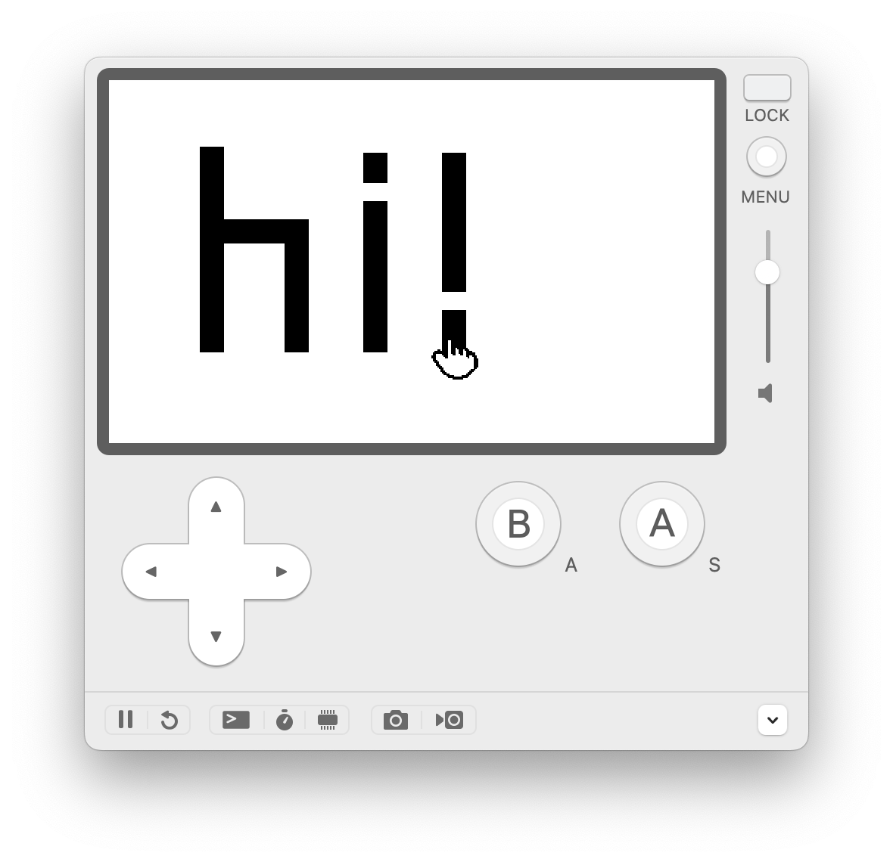

# Hello World, Playdate (on Rust)

A very simple starter [Playdate](https://play.date) game written in Rust using the [crankstart](https://crates.io/crates/crankstart) crate. 



---

# Running the game
## Pre-requisites

1. [**Rust**](https://www.rust-lang.org/) → If you’re here, you probably already have this installed. If not, I recommend installing via [Rustup](https://www.rust-lang.org/tools/install).
   - **cargo** → This is automatically installed for you if you install Rust via Rustup.
   - Rust nightly toolchain → Install by running `rustup toolchain install nightly`. Note this only makes the nightly toolchain available on your system but does not change your global Rust version to the nightly one. This is required because building games for devices uses non-standard Rust features, which is only available on the nightly toolchain.
2. [**Playdate SDK**](https://play.date/dev/) → The code in this game works with **Playdate SDK v2.6.2**. It will probably also work with the newly released [SDK v2.7](https://sdk.play.date/changelog/#_2_7_0), but I have not tested that yet. 
   - You can download v2.6.2 from [here](https://download-cdn.panic.com/playdate_sdk/) for your relevant OS. Follow the [Installation steps](https://sdk.play.date/2.6.2/Inside%20Playdate.html#_installation) to complete the process. Be sure to update your PATH variable to include the Playdate SDK — the instructions for doing that are [here](https://sdk.play.date/2.6.2/Inside%20Playdate.html#_set_playdate_sdk_path_environment_variable). 
   - Feel free to poke around the downloaded SDK to see what it comes with. You can even try running some of the sample games (written in Lua) that come with it. 
   - The Playdate Simulator is automatically installed for you as well.
3. [**crank**](https://github.com/pd-rs/crank) → This is the command line tool that will build this game into a Playdate-compatible binary. 
   - Install according to the instructions [here](https://github.com/pd-rs/crank). If you’ve already installed Rust and the Playdate SDK, you’ll only need to run the following command additionally: `cargo install --git=https://github.com/pd-rs/crank`

## To run this game on the Playdate simulator (no device required)

Run the following command from the project root directory:

```bash
crank run --release
```

## To run this game on the Playdate device

You obviously need a Playdate first. If you have one already, run the following command from the project root directory:

```bash
crank build --device --release
```

This creates a device-compatible binary in the [target](/target) directory that you can then [sideload onto your Playdate device](https://help.play.date/games/sideloading/).